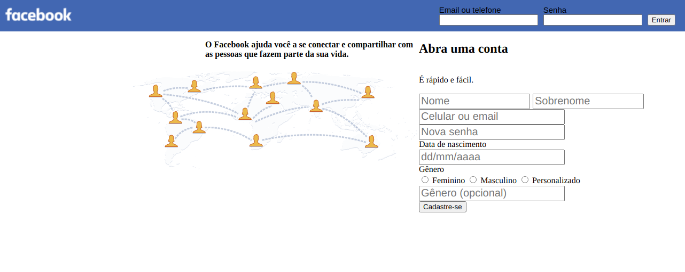
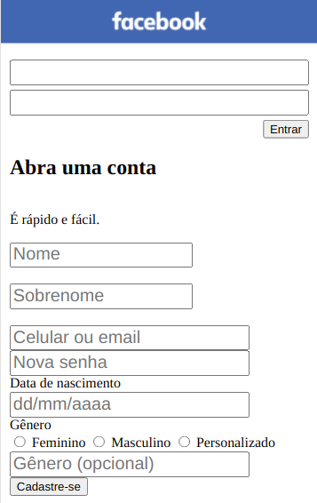

<h1 align="center">Facebook Signup Page</h1>

 

> Projeto para o aprendizado de Formulários HTML, Flexbox e CSS Responsivo

> HTML5 | CSS3

### ✨ [Demo](https://ricardorosa-dev.github.io/projects/06-facebook-signup-page)

## Author

👤 **Ricardo Rosa**

* Website: http://ricardorosa-dev.github.io/
* Github: [@ricardorosa-dev](https://github.com/ricardorosa-dev)
* LinkedIn: [@https://www.linkedin.com/in/ricardorosa-dev/](https://www.linkedin.com/in/ricardorosa-dev/)

## Show your support

Give a ⭐️ if this project helped you!

***
_This README was generated with ❤️ by [readme-md-generator](https://github.com/kefranabg/readme-md-generator)_
